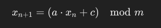
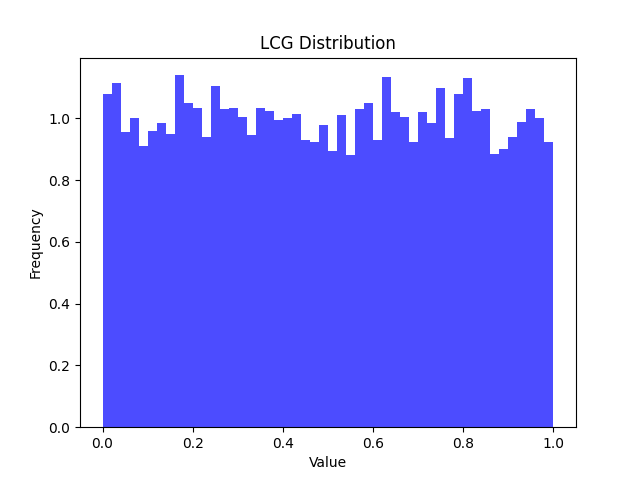
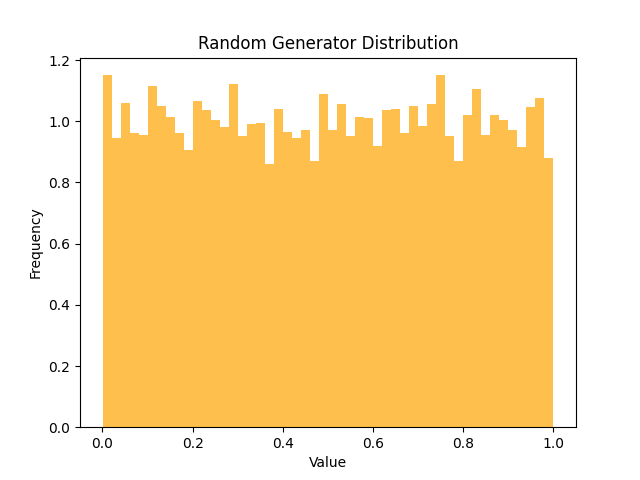

# Лабораторная работа: Генерация псевдослучайных чисел

## Введение
В рамках данной лабораторной работы была реализована функция генерации псевдослучайных чисел с использованием линейно-конгруэнтного генератора (ЛКГ). Генератор сравнивался с встроенным генератором случайных чисел в Python.

**Цель задания**: требуется реализовать генератор псевдослучайных чисел (ГПСЧ) — это программа, которая создает последовательности чисел, похожие на случайные. Однако эти числа не являются настоящими случайными, так как они генерируются алгоритмом. Если повторить те же условия, то последовательность чисел будет такой же, что и делает их "псевдо" случайными. Также необходимо сравнить результаты работы программы с тем, что выдает стандартный генератор случайных чисел в Python.

Задача разделена на три части:
- Реализация генератора чисел по предложенному алгоритму (линейно-конгруэнтного генератора).
- Сравнение с библиотечным генератором (например, `random` в Python).
- Тестирование генераторов: проверка на равномерность распределения чисел и дополнительные тесты на независимость и определение периода генератора.

**Что такое генератор псевдослучайных чисел?**
ГПСЧ в компьютерах генерируют последовательность чисел, которая выглядит случайной, но на самом деле предсказуема, если знать начальное значение генерации. Эти числа, сгенерированные программой, используют в симуляциях, играх, моделях случайных процессов и даже в криптографии, где нужны действительно хорошие случайные числа.

## Описание алгоритма
Реализован линейно-конгруэнтный генератор псевдослучайных чисел (ЛКГ) - один из простейших и наиболее распространенных алгоритмов для генерации псевдослучайных чисел, он основан на линейной рекурсии и вычисляет последовательность чисел по формуле:

     
  
Здесь:   
    x_{n+1} - это следующее число в последовательности.   
    x_n - текущие число.   
    a, c, и m - специальные параметры, которые нужно    задать, чтобы управлять генератором.   
    \mod - это операция "остаток от деления".   

Параметры были выбраны: a = 1664525, c = 1013904223, m = 2^32, x0 = 1.   

Далее были проведены автокорреляционный тест (тест на независимость) для ЛГК и для встроенного генератора Python (random), а также написана функция определения периода генератора. 

Более подробные комментарии по алгоритму и его реализации даны непосредственно в файле с кодом.

## Методы тестирования
- **Тест Колмогорова-Смирнова** проверяет равномерность распределения.
- **Автокорреляционный тест** проверяет независимость последовательных чисел (наличие или отсутствие значительной корреляции между последовательными числами в последовательности).
- **Период генератора** - пределение длины периода. Отсутствие обнаружимого периода в пределах 10000 чисел является хорошим признаком для случайного генератора.

## Результаты
### Вывод программы
При запуске программы были получены следующие результаты:
   
   
KS-statistic: 0.007874301645532267, p-value: 0.5619904385574752   
KS-statistic (random): 0.006717808140595916, p-value: 0.7548742711053148   
Для дополнительных тестов были следующие результаты:   
Autocorrelation (LCG): 44.08786127910911   
Autocorrelation (random): 137.2338279429568   
Period (LCG): None   
Period (random): None   

### Выводы
1. Распределение чисел:   
Оба генератора (ЛКГ и встроенный random) показывают высокие значения p-value (больше 0.05), что указывает на то, что сгенерированные числа имеют равномерное распределение.
2. Независимость:   
ЛКГ показывает высокую автокорреляцию, что указывает на зависимость между числами. Это является недостатком для генератора случайных чисел.
Встроенный генератор Python показал низкую отрицательную автокорреляцию, что говорит об отсутствии значимой зависимости между числами.
3. Период генератора:   
В обоих случаях не был найден явный период в пределах 10,000 чисел, что является хорошим признаком. Это значит, что оба генератора обладают достаточно длинным периодом и не повторяются в малых диапазонах.

## Заключение
Лабораторная работа продемонстрировала успешную реализацию генератора псевдослучайных чисел и его оценку с использованием статистического теста. Сравнение с библиотечным генератором показало, что разработанный генератор может эффективно генерировать числа, равномерно распределенные в диапазоне от 0 до 1, но проявляет сильную корреляцию между числами, что является недостатком. 
Встроенный генератор Python также хорошо справляется с равномерным распределением и показывает лучшие результаты в плане независимости чисел.
В обоих генераторах не обнаружен явный период в пределах 10,000 чисел, что является положительным фактором.
Эти результаты показывают, что встроенный генератор Python в целом является более качественным в плане независимости чисел, но ЛКГ также подходит для задач, не требующих высокой степени случайности.

